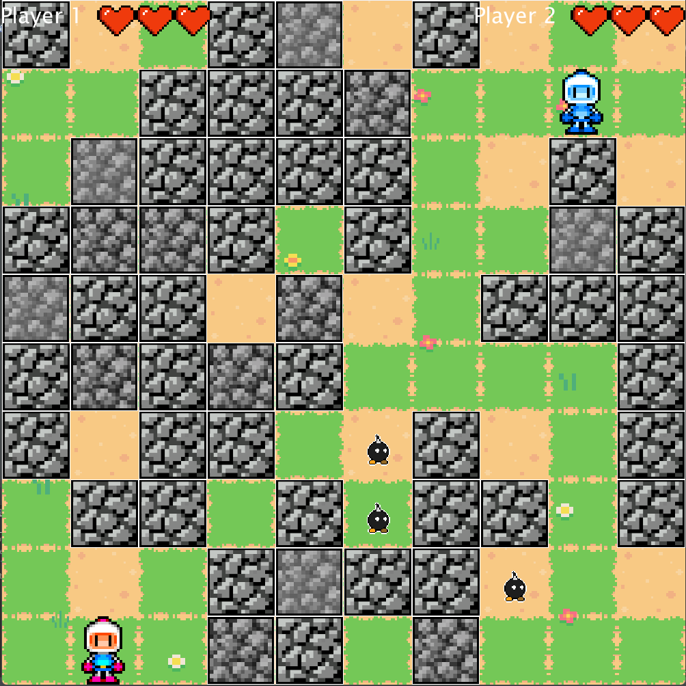

# Bomberman Game README

## Bomberman

## Descrição do Projeto

Bomberman é um jogo de ação onde o objetivo é sobreviver mais tempo que o outro jogador, evitando bombas e inimigos. Este projeto foi desenvolvido utilizando a biblioteca LibGDX.

## Tabela de Conteúdos

- [Descrição do Projeto](#descrição-do-projeto)
- [Instalação](#instalação)
- [Como Jogar](#como-jogar)
- [Dicas](#dicas)
- [Resumo Técnico](#resumo-técnico)

## Instalação

1. Clone o repositório:
   ```bash
   git clone https://github.com/Arthur020104/BombermanJava.git
   ```
2. Navegue até o diretório do projeto:
   ```bash
   cd BombermanJava
   ```
3. Compile o projeto:
   ```bash
   ./gradlew build
   ```
4. Execute o jogo:
   ```bash
   ./gradlew run
   ```

## Como Jogar

### Objetivo

O objetivo do jogo é sobreviver mais tempo que o outro jogador, evitando bombas e inimigos.

### Controles

**Player 1:**
- Mover para cima: Seta para cima
- Mover para baixo: Seta para baixo
- Mover para a esquerda: Seta para a esquerda
- Mover para a direita: Seta para a direita
- Colocar bomba: Shift Direito

**Player 2:**
- Mover para cima: W
- Mover para baixo: S
- Mover para a esquerda: A
- Mover para a direita: D
- Colocar bomba: F

## Dicas

- **Evite as bombas:** Tanto as suas quanto as do outro jogador podem feri-lo.
- **Fique de olho nos inimigos:** Eles também podem representar uma ameaça.
- **Utilize as paredes:** Elas podem ser destruídas pelas bombas e usadas para se proteger dos inimigos.
- **Power-ups:** Alguns blocos destrutíveis podem conter power-ups que melhoram seu poder explosivo ou concedem outras habilidades úteis. Tente quebrá-los para obter vantagem.
- **Planeje sua estratégia:** Pense antes de agir. Colocar bombas indiscriminadamente pode prendê-lo em uma situação perigosa.

## Resumo Técnico

O projeto Bomberman foi desenvolvido com a biblioteca LibGDX. A classe principal, `MainGame`, inicializa jogadores, inimigos e texturas, e o método `render` atualiza a lógica do jogo. As camadas (`Camada`) controlam diferentes aspectos, como a geração de texturas. Bombas colocadas pelos jogadores têm um tempo antes de explodirem e causam danos. A movimentação e interações são geridas por métodos específicos. O menu principal, gerenciado pela classe `MainMenu`, permite iniciar ou sair do jogo.